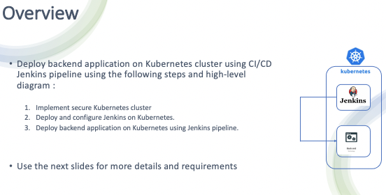
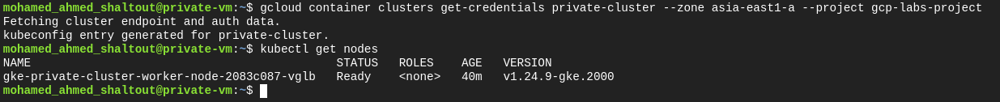

# Deploy backend application on Kubernetes cluster using CI/CD Jenkins pipeline

## Prerequisites
- Linux system
- GCP
- Terraform
- Kubernetes
- Jenkins
- Docker
## Getting Started
- make sure you have installed terraform 
- a valid GCP account
## Steps
- Configure your GCP credential

      gcloud auth login
- Clone this repo to your local machine

      git clone https://github.com/mohamedshaltout58/Finale-Project-Infra-structure
- Use Terraform to apply this infra structure scripts in [Terraform-files](Terraform-files/) directory

      cd Terraform-files
      
      terraform init
      
      terraform plan
      
      terraform apply
      
- SSH to your private-vm from GCP console and run this commands inside it to install gcloud and kubectl
       
       sudo apt-get install google-cloud-sdk-gke-gcloud-auth-plugin
       
       sudo apt-get install kubectl
       
- Now , go to your private-cluster from GCP console and choose connect and copy the showen command to your private-vm

       gcloud container clusters get-credentials [cluster-name] --zone [choosen zone] --project [project-id]

       kubectl get nodes
       

- Create namespace 
        
        kubectl create ns devops-tools
        
- Copy [jenkins-deployment](jenkins-deployment/) content to your private-vm and apply it 
       
       kubectl apply -f [file-name]
       
- You can check if your pod up and running and check our service in name space
      
      kubectl get all -n devops-tools
      
- From service get EXTERNAL-IP and attach port number :8080 then copy it to your browser to open jenkins GUI
- Now deploy the slave jenkins to your private-vm from [slave-jenkins](jenkins-deployment/slave-jenkins/) directory and you can find the dockerfile i used to build the images used in the slave-jenkins deployment
      
      kubectl apply -f [file-name]
- In slave-node pod we should first make some configurations inside it   
     
      kubectl exec -it [slave-pod-name]] -n devops-tools -- bash
     
- set password for jenkins user
    
      passwd jenkins
- make sure ssh service is up and running and docker permissions is right
  
      service ssh start
      chmod 666 /var/run/docker.sock 

- run this command to help in configuration of the pipeline 
      
      apt-get install gettext-base

- Now change to jenkins user to connect the cluster from this user
      
      su jenkins
      bash
      gcloud container clusters get-credentials [cluster-name] --zone [choosen zone] --project [project-id]
      gcloud auth configure-docker

- Make sure that your service account is up and running on this user in the slave pod

      gcloud auth list
            
      
- You can check [infra-images](infra-images/) directory to see the configuration of jenkins to add node and use it for the build process.

- You can find the app and the pipeline full configurations in [Finale-Project-App](https://github.com/mohamedshaltout58/Finale-Project-App)
 
